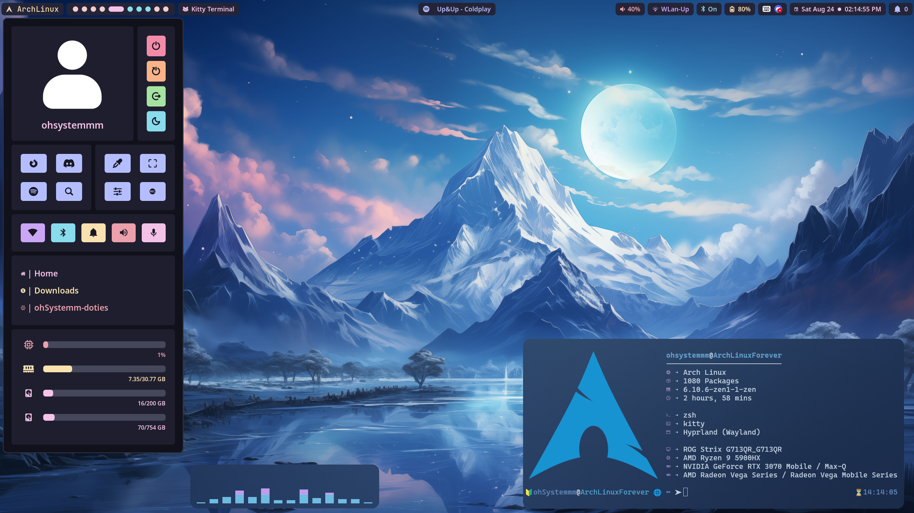
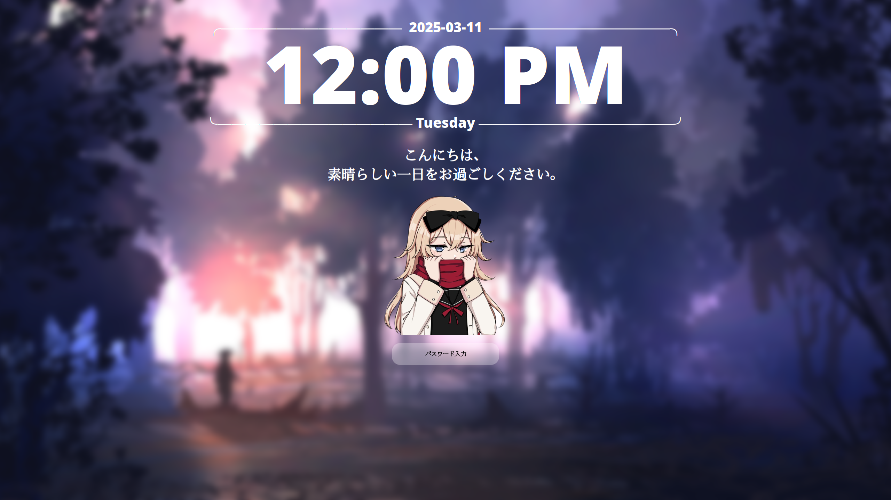
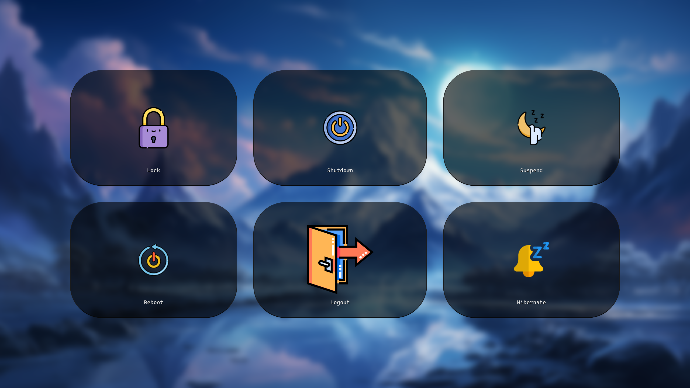
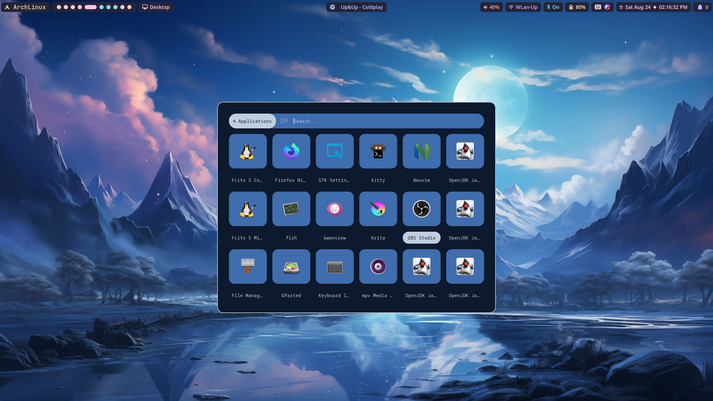
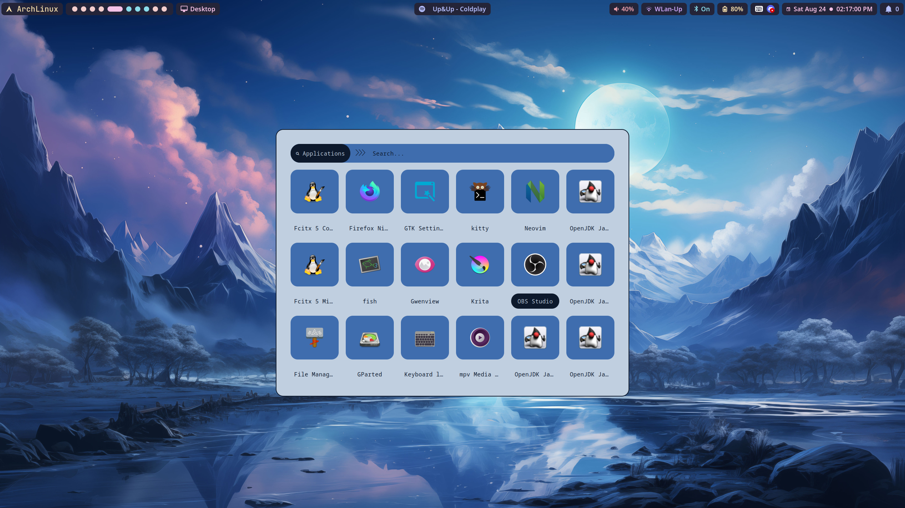

<!-- Badgets -->
<div align="center"> 


[](https://github.com/ohSystemmm/ohSystemmm-doties)


</div>

<!-- Header -->
<div align="center">

# **ohSystemmm-doties**

</div>


> [!WARNING]
> - Still under development; it won’t work until the upcoming release.
> - Upcoming Release 1st of September 2024


<!-- Overview -->
<div align="center">
  <h2>Overview</h2>
</div>

<details>
  <summary>Features</summary>
</details>

<details>
  <summary>Requirements</summary>
</details>

<details>
  <summary>Wiki</summary>
</details>

<details>
  <summary>Help & Issues</summary>
</details>

<p align = "center">


<!-- Screenhots -->
<div align="center">
  <h2>Screenshot (Defaults)</h2>
</div>

#### Home Screen


#### Hyprlock


#### Wlogout


#### Rofi



<!-- Management -->
<div align="center">
  <h2>Management</h2>
</div>

<details>
  <summary>Installation</summary>

### Installation
Be sure to back up your own configurations, as they may be overwritten. It's recommended to install these dotfiles on a fresh Arch installation without a desktop environment, though they should also work on an existing setup. The included Install script will provide guidance and instructions throughout the installation process.
```bash
$ git clone https://ohSystemmm/ohSystemmm-doties.git
$ cd ohSystemmm-doties/Action-Area.d/
$ ./Install.sh
```

</details>


<details>  
<summary>Updating </summary>

### Updating
To update the dotfiles, simply run the Update script, and it will handle everything automatically.
```bash
$ cd ohSystemmm-doties/Action-Area.d/
$ ./Update.sh
```

</details>

<details>
  <summary>Uninstall</summary>

### Uninstall
To uninstall, simply execute the Uninstall script. This will delete all ohSystemmm configurations, including grubtheme and sddm, and also remove any dotfiles from your system.
```bash
$ cd ohSystemmm-doties/Action-Area.d/
$ ./Uninstall.sh
```

</details>


<div align="center">
  <h2>Thank You</h2>

[Credits & Thank](Action-Area.d/Information/Credits.md)

</div>

