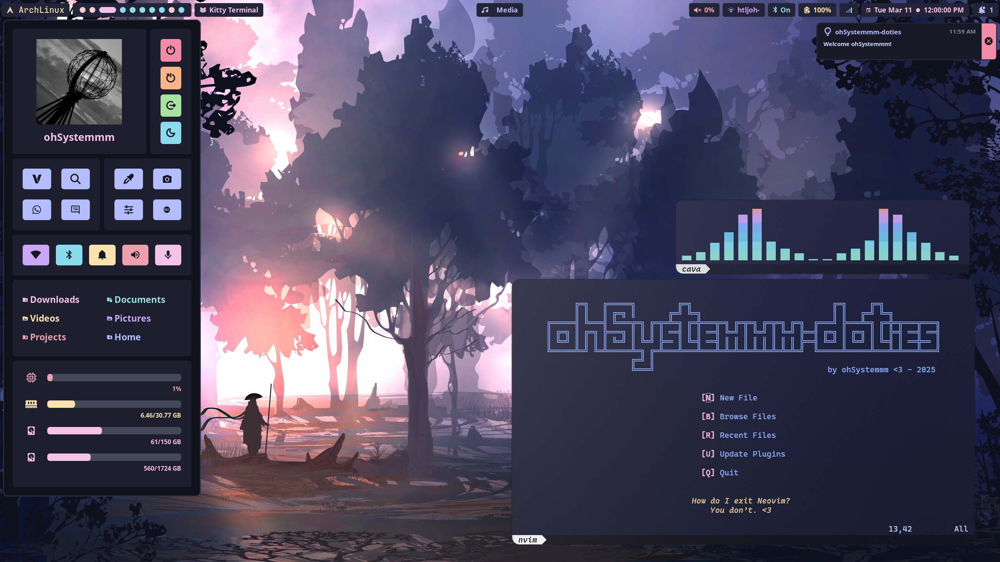
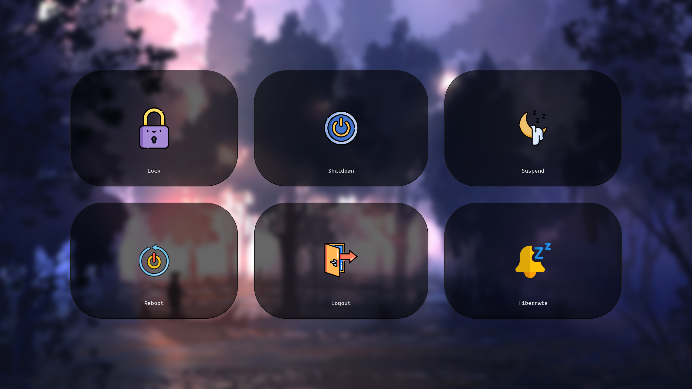

<p align="center">  
  
  
  <a href="https://github.com/ohSystemmm/ohSystemmm-doties">
    
  </a>
  
</p>
<div align="center">
  <h1>ohSystemmm-doties</h1>
</div>

> [!WARNING]
> - Being actively developed by [ohSystemmm](https://github.com/ohSystemmm) 
> - Do not run the Installation script twice - it might break your configuration

<div align="center"><h2>Overview</h2></div>

<details>
  <summary>Information</summary>
<br>
The ohSystemmm-doties dotfiles are crafted to provide a seamless and intuitive user experience from the moment you start. Pre-configured for quick setup, they offer a variety of customization options to fit your individual preferences. Their straightforward usability and adaptability make them an ideal choice for those looking to optimize their setup while retaining the ability to make personalized adjustments. Should you encounter any issues or bugs, don't hesitate to reach out for assistance. You can find my contact information on my GitHub profile.
<br>
</details>
<details>
  <summary>Requirements</summary>
<br>
The dotfiles are compatible with virtually any low-end device capable of running Hyprland. The primary requirement is an Arch Linux installation; while a fresh installation is preferred, it is not strictly necessary. A stable network connection is recommended, and you should also allocate some time for the installation process. The ohSystemmm-doties will automatically install the necessary packages required for the dotfiles to function properly. 
<br>
</details>
<details>
  <summary>Wiki</summary>
<br>
Not yet implemented, but expected to be included in version 2.2.5.
<br>
</details>
<details>
  <summary>Help & Issues</summary>
<br>
If you encounter any issues with the dotfiles and believe it to be related to the dotfiles themselves, please feel free to reach out or open an issue. 
You can find my contact information on my GitHub profile.
<br>
</details>
<p align = "center"> </p>
<div align="center">
  <h2>Screenshots</h2>
</div>

### Home Screen


### Hyprlock


### Wlogout


### Rofi-Wayland


<div align="center">
  <h2>Management</h2>
</div>

<details>
  <summary>Installation</summary>

### Installation
Be sure to back up your own configurations, as they may be overwritten. It's recommended to install these dotfiles on a fresh Arch installation without a desktop environment, though they should also work on an existing setup. The included Install script will provide guidance and instructions throughout the installation process. Also, make sure to run the script in a bare TTY. (Ctrl + Alt + F3/F4/...)
```bash
$ git clone https://github.com/ohSystemmm/ohSystemmm-doties.git
$ cd ohSystemmm-doties/Action-Area.d/
$ ./Install.sh
```
After successfully installing, be sure to explore the ~/ohSystemmm-doties/Control.sh file. Run it to set your wallpaper, system design, and more.
</details>
<details>  
<summary>Updating </summary>

### Updating
To update the dotfiles, simply run the Update script, and it will handle everything automatically.
```bash
$ cd ohSystemmm-doties/Action-Area.d/
$ ./Update.sh
```

</details>
<details>
  <summary>Uninstall</summary>

### Uninstall
To uninstall, simply execute the Uninstall script. This will delete all ohSystemmm configurations, including grubtheme and sddm, and also remove any dotfiles from your system.
```bash
$ cd ohSystemmm-doties/Action-Area.d/
$ ./Uninstall.sh
```

</details>
<div align="center">
  <h2>Thank You</h2>
</div>

